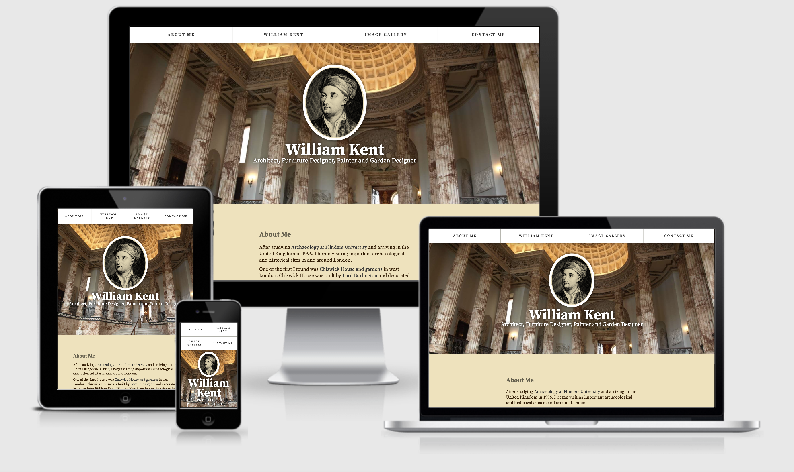

# RWD 2 - Start Coding

## Starting your portfolio page

You are going to develop a single page portfolio. This one page introduces you to the basics of RWD (responsive web design), mobile first web development and further elements of page layout, typography, web design and coding.

<figure>

<figcaption>
Derren's demonstration site - The Responsive Portfolio.
</figcaption>
</figure>

## Contents

* [Task 1 - Getting started](#Task-1---Getting-started)
* [Task 2 - Review of HTML template](#Task-2---Review-of-HTML-template)
* [Task 3 - Adding your content and metadata](#Task-3---Adding-your-content-and-metadata) 
* [Task 4 - The CSS re-set](#Task-4---The-CSS-re-set)
* [Task 5 - Selecting and adding Google Fonts](#Task-5---Selecting-and-adding-Google-Fonts)
* [Task 6 - Selecting a colour scheme](#Task-6---Selecting-a-colour-scheme)
* [Checklist](#RWD-2---Checklist)

---

## Task 1 - Getting started

You have two options. You can switch from one to the other at any time.

- Download the template portfolio code from GitHub and extract to your computer.
> **Download** - [The IWD Template Portfolio Site](https://github.com/mmu-webdesign/l4-IWD-web-term-2-template)
- OR 
> **Fork** - [‘fork’ the code from the Replit.com website](https://replit.com/@wilsonderrenmmu/IWD-template). 

**Using the Replit.com method will make it easier to test your website on different devices.**

### Instructions for GitHub
- Select the green _Clone or download_ button, select _Download ZIP_. 
- A file called `l4-IWD-web-term-2-template-master.zip` will download.
- Locate the ZIP file and extract the contents.
- Extract the folder to a safe location on your computer.
- A folder called `l4-IWD-web-term-2-template-master` will be created.
- You want the folder `portfolio` inside. 
- Move this folder to a safe location on your computer.
- Using _Visual Studio Code_ - open folder to define on the `portfolio` folder. Open `index.html` and `layout.css`.

> Where did you save the portfolio folder? Is it safe? Will it be backed up regularly? Will you lose all of your work if you accidentally delete the folder? Can you find it next week?

[VIDEO - Demonstration of downloading and extracting the files, defining the site in Visual Studio Code, testing and viewing in a browser.](https://youtu.be/h5Tvh7dPPxs) 

#### Key points for GitHub

- Put the folder `portfolio` somewhere safe.

- It is the folder `portfolio` that you will be submitting.

---


### Instructions for Replit.com

* Log-in to Replit.com
* Go to [the replit.com code](https://replit.com/@wilsonderrenmmu/IWD-template) with your web browser
* Choose ‘Fork repl’ and the code will be copied into your Replit.com area
* Click ‘Run’ to see updates to your code
* You can invite the tutors to your code and we can leave comments on your work
* Your work is autosaved
* You can view your work by using the web address in the top right hand box above the web view in Replit.com, for example [https://IWD-template.wilsonderrenmmu.repl.co](https://IWD-template.wilsonderrenmmu.repl.co).

---

### Test the files

> **DO NOT use Internet Explorer 11**. Use Chrome and/or Firefox. Safari is OK, but can cause some issues.

- Test `index.html` displays some content. At the moment it won’t be totally responsive, but if you are just adding HTML content it won’t be far off.
- Check `layout.css` is working by adding the line: 

```
* { border:1px solid red; } 
 ```
- Save `layout.css` and re-load `index.html` in the browser. Everything should get a red border. Yes? Then you can delete this line of CSS.

### Your *root* folder

The `portfolio` folder is the root of your website. This will contain all the files and sub-folders of your portfolio site. Don't link to any files outside of this folder. Come submission, you will submit this folder and its contents.


### Working *mobile first*

**Important**

> Keep your browser window small (mobile size - no more than half) - don't develop your site with your browser set to fill the screen - we are developing *mobile first*.

### MS Windows specific issues

**If you use a windows computer, read this:** 

>File extensions - .html .css .js .pdf

On Windows computers, you might have trouble seeing the file names, because Windows has an option called Hide extensions for known file types turned on by default. Generally you can turn this off by going to Windows Explorer, selecting the Folder options... option, unchecking the Hide extensions for known file types checkbox, then clicking OK. For more specific information covering your version of Windows, you can search on the web.

Also, for the moment **avoid using MicroSoft Edge** browser. Edge may still have security features that makes it hard to use *local files*, i.e. viewing/linking a HTML file on your own computer. 

**Avoid MS Explorer altogether!** Use Chrome or Firefox. You can test on other browsers later.

---

## Task 2 - Review of HTML template

This illustration of Derren's demonstration page relates the code for each semantic element of the page to what you see. Use this as a visual guide as you build your page and create your own versions of these elements, including the responsive menu and gallery.

### Download the PDF

> [Illustrated page layout & code structure](design-templates/apprentice-website-structure.pdf)

---

## Task 3 - Adding your content and metadata


### Add your content
 
 Using the content created over the last week, add it to `index.html` in the `About` and `Work` sections. 

- **About me** – 150 words maximum plus relevant links.

- **Topic** – 250 words maximum. 

- Please note the word counts - students do lose marks for lack of effort.

### Tag up your content

Apply html *tags* to your content. Remember to use headings, paragraphs, links, and lists as appropriate to structure your content.

### Coding tips

- Only one `<h1>`
- Headings are about levels of importance. Therefore if each sub-section is of equal importance, they will all be for example `<h2>`.
- Don't use `<br>` to create space - that's done later with CSS.
- Create space with `<p>`, don't have big blocks of text (a single paragraph).
- Use lists and tables if appropriate.


>**No CSS** - at this point do not apply any CSS. With your browser at mobile size, view your content as you apply the html. Your browser will apply its default styles. The page should display reasonably well with these styles. You will apply your own styling later.  


### Metadata

In the `<head>` of your page you have the three important elements of metadata:

#### Meta viewport
```

<meta name="viewport" content="width=device-width, initial-scale=1">

```
For a deeper understanding of the meta viewport tag read the MDN article - [Using the viewport meta tag to control layout on mobile browsers](https://developer.mozilla.org/en-US/docs/Mozilla/Mobile/Viewport_meta_tag).

#### The `<title>` element

`<title>` is not strictly a meta tag, but this is valuable metadata about your page/site. 

```
<title>NEVER forget to write a good page title</title>
```

Title - The homepage `<title>` should set a content for the whole site. It can be expanded upon in the meta description. This is easy if you are the BBC or Nike, or your name is fairly distinctive (Richard Eskins?). Otherwise this can be tough. Any sub-pages should start *function first*, for example `Contact - Richard Eskins`. To understand the importance of the title read the [the MOZ SEO Guide to the title tag](https://moz.com/learn/seo/title-tag).

#### The Meta Description

As we have previously explained the meta description is usually displayed on the Google results page along with the URL of your site.

Write a good description that complements and expands on your title.
```
<meta name="description" content="Add your meta description here">
```
As this is the homepage, the description should reflect the site as a whole. Descriptions between 50–300 characters. For a deeper understanding see [the MOZ SEO Meta Description Guide](https://moz.com/learn/seo/meta-description).

#### A plea from us...

Neither your title, meta description or your main heading should contain the words *hello* or *welcome*. Please! 

## Before you go further

> [Validate your HTML coding](https://validator.w3.org/#validate_by_upload). Fix any problems continuing.

---

## Task 4 - The CSS re-set

### Box sizing

We would like you to add two essential CSS re-sets to `layout.css`.

```
/* box sizing */
```
Find the above comment in `layout.css` and [add the border box model CSS code from this article](https://www.paulirish.com/2012/box-sizing-border-box-ftw/). Copy &amp; paste the code, and save.

You will remember that by default browsers define a box size as `width or height + padding + border` = actual width or height. Applying `box-sizing: border-box;` means the width or height includes any padding and/or border. This tends to make life easier - you want a 200px wide box, that's what you now get. For a more detailed explanation see [Box Sizing explained on CSS Tricks](https://css-tricks.com/box-sizing/).

At the moment this won't make any difference to you page. That comes later. 

### Flexible images

Look for this comment in `layout.css`.

```
/* flexible content images code */
```
Looking at `index.html` in your browser you will have noticed that the images we have provided do not fit (*when your browser window is mobile sized*) and cause an ugly horizontal scroll bar.

To fix this problem add this [flexible image CSS code from Derren's CodePen](https://codepen.io/wilsondmmu/pen/ZvPBgv) to `layout.css`. 

Save the changes to `layout.css` and reload `index.html` in your browser. You will now see that the dummy images we have provided size themselves to the browser window. Whilst this does not deliver true *responsive images* - that would serve different size images to different size screens, it does provide a simple solution.

Remember to add comments as you further develop your CSS to ensure developers (and tutors) understand your workings. The syntax for CSS comments: 

 ```
 /* your comment */
 ```
---

## Task 5 - Selecting and adding Google Fonts

As you already know, Web Fonts offer a much wider array of options beyond the basic web safe font families. It is now possible to create or buy Web Fonts to enhance the design of your site. Google Fonts provides a free and easy to use option. 

There are some drawbacks. 

- Adding Web Fonts to your page increases the overall download time and *weight* of the page. 
- Fonts can be costly. 
- Free doesn't always mean good. 

We would like you to select either a single Google Font for both your headings and text, or a pair of complementary fonts (one for headings, one for the text). 

Please note that by using Google Fonts we are not asking you to download the fonts you are using. Add the link (you can use one link for both fonts if you select 2) to your HTML and the fonts to your `font-family`.

### Selecting and adding your Google Font(s)

- Identify a single font (or font pairing) on [Google Fonts](https://fonts.google.com/): it could be for your headings, for your *body copy*, or for both.

### Help in selecting your fonts

- [Layouts designed with Google Fonts](https://femmebot.github.io/google-type/) 
- [The best Google fonts according to Typewolf](https://www.typewolf.com/google-fonts)

### Apply your selected Google Font(s)

Once you have chosen your font(s), they need to be added to your HTML and CSS.

- Add the Google Font code for your *body copy* to the `<head>` of your `index.html` file, **before the link to** `layout.css`. Repeat this if you have selected a second font.
- Add the font-family CSS rule from Google Fonts to your body rule in `layout.css`.
- By default Google provides the family of the font you have selected and a generic fallback. Insert between these [a suitable web safe font](https://codepen.io/wilsondmmu/pen/ZaJwOy).
- Base font (body) should read - Google font, web safe font, fallback.

Save `layout.css` and view the changes to `index.html` in a browser.

---

[VIDEO - Demonstration of selecting and implementing Google Fonts. ](https://www.youtube.com/embed/0M1HcLQcces)

---


```
/* element styling (e.g. standard p, h1, h2, a, etc) */
```
Find the above comment in `layout.css` and add styles to headings and paragraphs.

> **Remember** that at the moment all of these styles are for your mobile design. If the defaults are working, don't adjust for the sake of it.

- Once you have applied a Google font to the body element, all text will inherit this style (except for the form - more later). Don't reapply the same font to headings or paragraphs in your CSS. 

- If you have selected a second Google Font for headings you will need to apply this (usually to all headings).


```
h1,
h2 {
    font-weight: normal;
    font-family: sans-serif;
    /* Google font, web safe font, generic fallback */
}
```
- Add a font-size in rems.
- Remember that 1rem equals the font size of the html element (which for most browsers has a default value of 16px). You can use the 10px trick o make things easy.
- Experiment with the values below, adjusting them to sizes that suit your design.

> For example as your design evolves you will find the padding for your h2 will need adjusting to create space.

- For more about the different ways of setting the font size - [CSS Tricks Font Sizes article](https://css-tricks.com/almanac/properties/f/font-size/).

```
h1 {
    font-size: 2rem;
    margin: 0;
    padding: 0;
}

h2 {
    font-size: 1.5rem;
    margin: 0;
    padding: 0;
}

h3 {
    margin: 0;
    padding: 0;
}

p {
    margin: 0;
    padding: 0;
}

```
Experiment to see what works best for your chosen fonts. Are the paragraphs legible? Are the headings suitably big enough?

Remember elements like padding can be adjusted as such:

```
padding-top: 5px;
padding-right: 5px;
padding-bottom: 10px;
padding-left: 5px;

```
Or like this with short hand...

```
/* top | right | bottom | left */

padding: 5px 5px 10px 5px;

```
See [MDN Padding for more on the properties and shorthand](https://developer.mozilla.org/en-US/docs/Web/CSS/padding).


> **Remember** we are still mobile size. 

### Line height

- Next adjust the line-height in your body rule. Adjust to improve the legibility of your text. 

[Read the MDN article on Line Height](https://developer.mozilla.org/en-US/docs/Web/CSS/line-height) to learn why it is better to use `number` values instead of `length` values  and why a minimum of 1.5 is good for accessibility. 

- Save `layout.css` and check it's working by viewing `index.html` in your mobile size browser. Does it look right? Is it easy to read? 

- Adjust your CSS it until you are satisfied. Ask tutors and friends to take a look.

- Style your header `<h1>` and section `<h2>` headings by changing one or two things about them: font-weight, font-size, color, text-transform: uppercase, letter-spacing etc.

As the project develops you will adjust and enhance these settings. You may spot a *better* font. You will improve your writing and you will undoubtedly add more sophisticated styles. 

> **Remember** that you are always aiming for lean, efficient coding. Don't just keep adding for the sake of it. Make sure (especially in CSS) that you aren't repeating rules for styles already applied.

---

## Task 6 - Selecting a colour scheme

On our [illustration of the layout (pdf)](design-templates/apprentice-website-structure.pdf) we alternate between white, chamois type yellow and grey background colours for each section, plus the navigation and footer. We would like you to select an appropriate colour scheme for these contrasting areas. This would include colours for:

- Body text
- Headings
- Navigation (background)
- Navigation (text colour)
- Sections (background) - two complementary/contrasting colours
- Footer (background)
- Link colours (all states)

[Research a colour scheme - try coolors.co](https://coolors.co/). 

> Choose one primary colour and use tints and shades of that colour for the backgrounds. You may also want to select an accent colour. 

 **Don't create a colour scheme full of strong colours**.

**Colour contrast** - check that that each colour/tint has a strong contrast with your text colour. Test each section colour by using [Lea Verou's Contrast ratio checker](http://contrast-ratio.com/). You are looking for a AAA (green) pass for each section. 

We will apply the colours later.

If you want to learn more [read Building Your Color Palette](https://refactoringui.com/previews/building-your-color-palette/). This will help in selecting your palette, including selecting primary and accent colours.

### Colour Scheme Try Out Machine

To help you develop and test a colour scheme Derren has created a handy tool which you can use to apply your chosen colours on a block of text and a link. It will also check the colour contrast ratio between the foreground and background.

[Link to the Magic Colour Scheme Try Out Machine](https://55060509.webdevmmu.uk/colour-chooser/colour-chooser/acw2.html).


### Colour resources

- [Coolors.co](https://coolors.co/) - a really good colour palette chooser.
- [Adobe colour wheel](https://color.adobe.com/create/color-wheel/) - you may also want to try out this colour tool which helps you come up with colour palettes for your site.
- [CSS for Backgrounds](http://cssreference.io/backgrounds/) - a reference site for all the ways we can control backgrounds in CSS.

## Colour accessibility

You must ensure that you maintain a good contrast between background and foreground colours. You can use a variety of contrast checking tools to ensure that the colours your choose conform to the WCAG (Web Content Accessibility Guidelines) standards and provide sufficient contrast. Read [MDN's article on Colour Contrast](https://developer.mozilla.org/en-US/docs/Web/Accessibility/Understanding_WCAG/Perceivable/Color_contrast).

- [WebAIM Colour Contrast Checker](https://webaim.org/resources/contrastchecker/) 
- [WebAIM Link Contrast Checker](https://webaim.org/resources/linkcontrastchecker/)
- Lea Verou's [Contrast Ratio checker](https://contrast-ratio.com/).


> BBC Gel (Global experience language) has a video that is worth watching as it explains how the accessibility of products we design and develop affect disabled people's lives in a variety of ways. [Video - It's our passion, joy, and responsibility to build a great BBC for everyone](https://www.bbc.co.uk/gel/articles/bbc-for-everyone).

---

## Testing

At the end of this session [validate your HTML](https://validator.w3.org/#validate_by_upload) and [validate your CSS](https://jigsaw.w3.org/css-validator/#validate_by_upload). **Fix any problems**.

---

## RWD 2 - Checklist

### Are you up to date?

Before you start the next chapter - Have you completed everything?

- Download the template files from GitHub
- Define the site in Visual Studio Code and view the files (`index.html`and `layout.css`)
- Working mobile first - resize your browser
- Review the structure - understand how the design is reflected in the semantic markup.
- [View the full layout PDF](design-templates/apprentice-website-structure.pdf).
- Add your content to `index.html` and tag it up.
- Validate to check for errors.
- Add the box sizing and flexible image CSS re-sets.
- Select and add your Google fonts.
- Select a colour scheme ready for implementing next.

And finally:

- Fix any problems before you continue.
- Keep your browser window small - don't use it at full screen yet. We are still *mobile first*.


